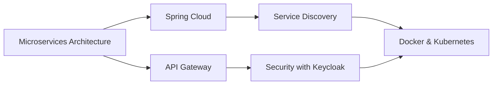

# 👋 Hi, I'm Anouar Ech Charai

<div align="center">
  
</div>

<div align="center">
  
  [](https://linkedin.com/in/anouar-ech-charai)
  [](https://your-portfolio.com)
  [](mailto:anouar@example.com)
  
</div>

---

## 🚀 About Me

```typescript
const anouar = {
    location: "Casablanca, Morocco 🇲🇦",
    role: "Full Stack Developer (Back-End Oriented)",
    education: ["Youcode @ UM6P", "USMBA"],
    currentFocus: ["Spring Boot", "Angular", "Microservices", "Keycloak"],
    lifePhilosophy: "Building secure, scalable applications with clean code",
    funFact: "I speak fluent Java and TypeScript ☕️"
};
```

---

## 💻 Tech Stack

### 🎯 Back-End Development


### 🎨 Front-End Development


### 🗄️ Databases & ORM


### 🔐 Security & Identity Management


### 🐳 DevOps & Tools


---

## 📊 GitHub Statistics

<div align="center">
  
  
</div>

<div align="center">
  
</div>

<div align="center">
  
</div>

---

## 🏆 Featured Projects

<div align="center">

| Project | Description | Tech Stack |
|---------|-------------|------------|
| 🚛 **[LogiTrack](https://github.com/anouarechcharai/logitrack)** | Logistics & Warehouse Management System | Spring Boot, PostgreSQL, Angular |
| 🛒 **[ShopZone](https://github.com/anouarechcharai/shopzone)** | Full-Featured E-commerce Platform | Laravel, MySQL, TailwindCSS |
| 💼 **[CareerLink](https://github.com/anouarechcharai/careerlink)** | Career Management Application | Spring Boot, Keycloak, Angular |
| 🎬 **[Cinema Manager](https://github.com/anouarechcharai/cinema-manager)** | Cinema Management System | Java, Spring Security, PostgreSQL |

</div>

---

## 🎯 Current Focus



- 🔭 Building enterprise-level microservices
- 🌱 Mastering Angular advanced patterns
- 👯 Looking to collaborate on open-source projects
- 💬 Ask me about: **Spring Boot, Keycloak, RESTful APIs, Security**
- ⚡ Fun fact: I debug with coffee ☕️

---

## 📈 Contribution Graph

<div align="center">
  
</div>

---

## 🎓 Certifications & Learning Path

- ✅ **Spring Framework Professional**
- ✅ **Java SE 11 Developer**
- ✅ **Angular Certified Developer**
- 📚 Currently learning: **Kubernetes & Cloud Architecture**
- 📚 Next on list: **AWS Certified Solutions Architect**

---

## 💡 Philosophy

> "Clean code is not written by following a set of rules. You don't become a software craftsman by learning a list of what to do and what not to do. Professionalism and craftsmanship come from discipline and experience."
> 
> — Robert C. Martin

---

## 📫 Let's Connect!

<div align="center">
  
  💼 Open to freelance opportunities and collaboration
  
  🌟 If you find my work helpful, consider giving it a star!
  
  
  
</div>

---

<div align="center">
  
  ### Show some ❤️ by starring some of my repositories!
  
  
  
</div>
